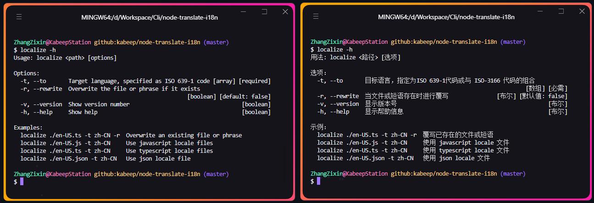
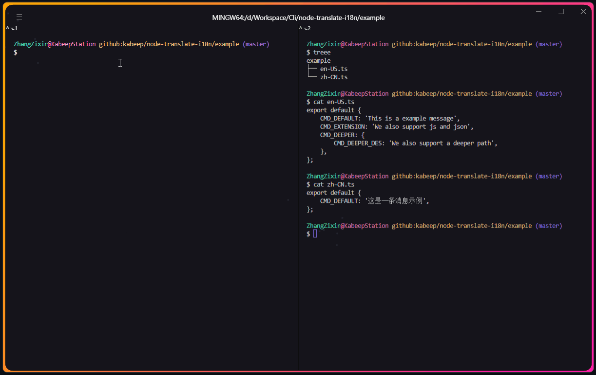

<div align="center">


用于将本地化文件翻译为其他语言的命令行界面工具。

---

[](https://nodejs.org/docs/latest/api/)
[](LICENSE)
[](https://www.npmjs.com/package/@kabeep/node-translate-i18n)
[](https://codecov.io/gh/kabeep/node-translate-i18n)
[](https://app.codacy.com/gh/kabeep/node-translate-i18n/dashboard?utm_source=gh&utm_medium=referral&utm_content=&utm_campaign=Badge_grade)
[](https://dl.circleci.com/status-badge/redirect/circleci/Qh23T2Zgw4Fy4V8uvKaymp/SM7PbTQQQRHifxy6jgNcTm/tree/master)

[English](README.md) | 简体中文




</div>

## 📖 简介

> node-Translate-i18n 是一个用于多语言国际化的工具，能够轻松地将本地化文件翻译成其他语言，例如为 `en-US.js`
> 翻译一份中文本地化文件 `zh-CN.js`。
>
> 通过简单的命令行界面，您可以快速将项目的本地化文件转换成所需的目标语言，实现 NodeJS
> 项目跨语言的国际化支持。

## ⚙️ 安装

```bash
npm install @kabeep/node-translate-i18n --save
```

```bash
yarn add @kabeep/node-translate-i18n
```

```bash
pnpm add @kabeep/node-translate-i18n
```

## 🚀 使用



#### 在 Javascript 中使用

```javascript
import localize from '@kabeep/node-translate-i18n';

localize({
    _: ['./src/locale/en-US.ts'],
    to: ['zh-CN', 'ja-JP'],
    rewrite: true,
})
    .then(console.log)
    .catch(console.error);
```

#### 在终端中使用

```shell
localize ./en-US.ts -t "zh-CN" "ja-JP" -r
```

```text
用法: localize <路径> [选项]

选项：
  -t, --to       目标语言，指定为ISO 639-1代码或与 ISO-3166 代码的组合
                                                                   [数组] [必需]
  -r, --rewrite  当文件或短语存在时进行覆写               [布尔] [默认值: false]
  -v, --version  显示版本号                                               [布尔]
  -h, --help     显示帮助信息                                             [布尔]

示例：
  localize ./en-US.js -t zh-CN     使用 javascript locale 文件
  localize ./en-US.ts -t zh-CN     使用 typescript locale 文件
  localize ./en-US.json -t zh-CN   使用 json locale 文件
  localize ./en-US.ts -t zh-CN -r  覆写已存在的文件或短语
```

## 🪄 例子

#### 新增

> 对于不存在的本地化文件，cli 会使用由源文件翻译的译本创建并写入新的文件
> （文件名来自 to 参数）。

```shell
# locale
#   ├── en-US.js (1 row)
# =>
# locale
#   ├── en-US.js (1 row)
# + ├── zh-CN.js (1 row)
localize ./locale/en-US.js -t "zh-CN"
```

#### Diff

> 当 `to` 参数中的本地化文件已存在时，会通过 `diff` 仅写入新增的短语。
> 这在已经通过更准确的翻译结果手动修改过某些短语时非常实用。

```shell
# locale
#   ├── en-US.js (2 row)
#   ├── zh-CN.js (1 row)
#   ├── ja-JP.js (2 row)
# =>
# locale
#   ├── en-US.js (2 row)
# M ├── zh-CN.js (2 row)
#   ├── ja-JP.js (2 row)
localize ./locale/en-US.js -t "zh-CN" "ja-JP"
```

#### 覆写

> 当 `to` 参数中的本地化文件已存在时，会覆写已存在的短语。

```shell
# locale
#   ├── en-US.js (2 row)
#   ├── zh-CN.js (2 row)
#   ├── ja-JP.js (2 row)
# =>
# locale
#   ├── en-US.js (2 row)
# M ├── zh-CN.js (2 row)
# M ├── ja-JP.js (2 row)
localize ./locale/en-US.js -t "zh-CN" "ja-JP" -r
```

## 🔩 支持的 `to` 参数

- [ISO 639-1](https://www.loc.gov/standards/iso639-2/php/code_list.php)

```text
en, zh, ru, ...
```

- [RFC 4647](https://www.rfc-editor.org/rfc/rfc4647.txt)
  （[ISO 639-1](https://www.loc.gov/standards/iso639-2/php/code_list.php)，
  [ISO 15924](https://unicode.org/iso15924/iso15924-codes.html)
  与 [ISO 3166-1](https://www.iso.org/obp/ui/#search) 的任意组合）

```text
en-US, zh-CN, zh-TW, ru-RU, ...
```

- 自定义的文件后缀

```text
en-US.locale, zh-CN.locale, zh-TW.locale, ru-RU.locale, ...
```

## 📄 支持的文件类型

- Javascript
- Typescript
- JSON

## </> 支持的代码风格

不限制层级的键值对，可以参考
[format.js document](https://formatjs.io/docs/core-concepts/basic-internationalization-principles/)
或者 [polyglot.js document](https://airbnb.io/polyglot.js/)

以下是一个示例：

```json
{
    "GREETING": "Hello {name}!"
}
```

或者

```javascript
export default {
    "GREETING": "Hello world!",
    "DICTIONARY": {
        "GRETTING": "Hello {{name}}!"
    }
}
```

## 🔗 关联库

- [i18n-cli](https://github.com/pandodao/i18n-cli) - 一个 CLI 工具，利用 OpenAI API 翻译基于 JSON 的语言环境文件
- [locize-cli](https://github.com/locize/locize-cli) - locize cli 导入/导出语言环境、添加/编辑/删除、同步片段
- [node-polyglot](https://github.com/airbnb/polyglot.js) - 让您的 JavaScript 能够讲多种语言。
- [node-translate](https://github.com/kabeep/node-translate) - 🦜 一个强大、安全且功能丰富的 API，通过 Google 翻译。
- [node-translate-cli](https://github.com/kabeep/node-translate-cli) - > 一个强大、安全且功能丰富的终端工具，通过 Google
  翻译。_

## 🤝 贡献

欢迎通过 Pull Requests 或 [Issues](https://github.com/kabeep/node-translate-i18n/issues) 来贡献你的想法和代码。

## 📄 许可

本项目采用 MIT 许可证。详情请见 [LICENSE](LICENSE) 文件。